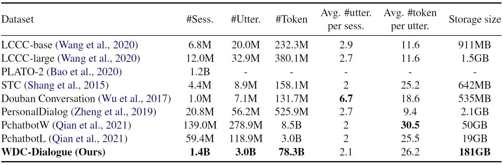
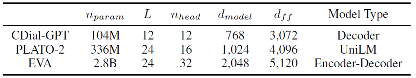
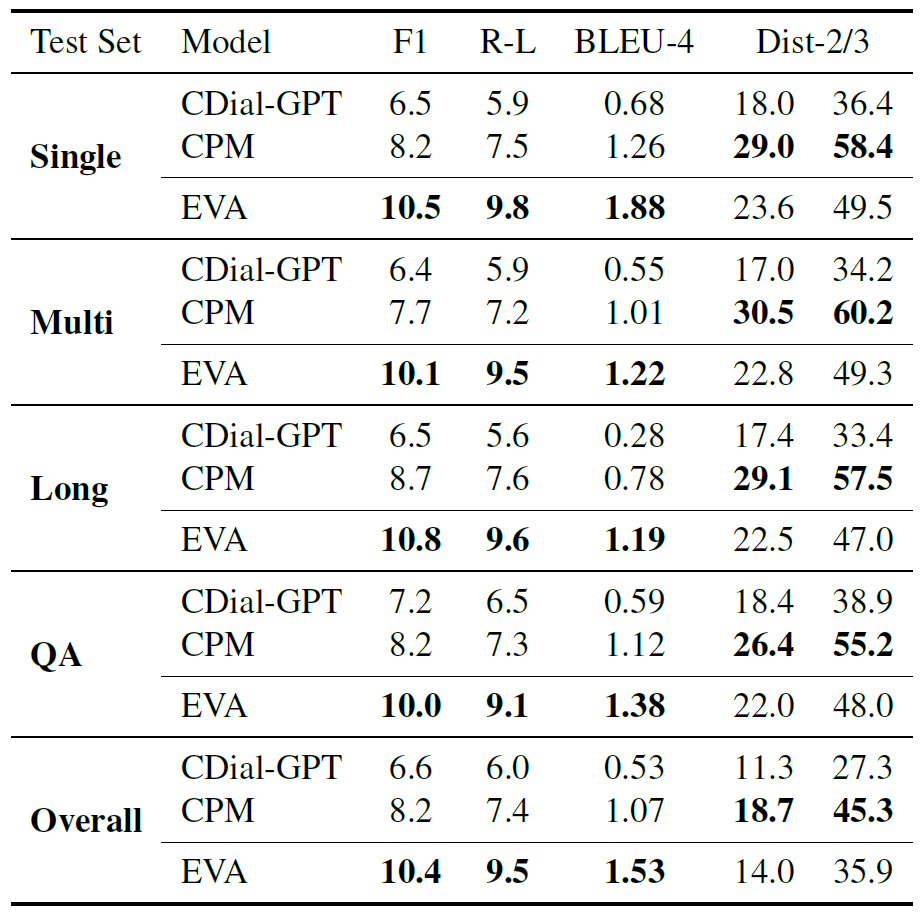

# EVA: An Open-Domain Chinese Dialogue System with Large-Scale Generative Pre-Training

## 1 Introduction

EVA is an open-domain Chinese pre-trained model, which contains the largest Chinese dialogue model with 2.8B parameters and is pre-trained on WDC-Dialogue, including 1.4B Chinese dialogue data from different domains. Paper link: https://arxiv.org/abs/2108.01547.

## 2 Dataset

We construct a dataset named **WDC-Dialogue** from Chinese social media to train EVA. Specifically, conversations from various sources are gathered and a rigorous data cleaning pipeline is designed to enforce the quality of WDC-Dialogue. We mainly focus on three categories of textual interaction data, i.e., **repost** on social media, **comment** / **reply** on various online forums and online **question and answer (Q\&A)** exchanges. Each round of these textual interactions yields a dialogue session via well-designed parsing rules. The following table shows statistics of the filtered WDC-Dialogue dataset and other Chinese dialogue datasets.



## 3 Model

**EVA** is a Transformer-based dialogue model with a bi-directional encoder and a uni-directional decoder. We present the EVA's model details and a comparison with previous large-scale Chinese pre-trained dialogue models in the following table.

<div align=center>

</div>

The model can be downloaded in [BAAI's repository](https://wudaoai.cn/model/detail/EVA). The downloaded folder should have the following structure:

```[bash]
eva/
├── 222500
│   └── mp_rank_00_model_states.pt
├── latest_checkpointed_iteration.txt
```

## 4 Experiment

We compare EVA with Chinese pre-trained models including [CDial-GPT](https://github.com/thu-coai/CDial-GPT) and [CPM](https://github.com/TsinghuaAI/CPM). Results in the automatic evaluation including uni-gram F1, ROUGE-L, BLEU-4 and distinct n-grams are shown as follows:

<div align=center>

</div>
  
We also present an example of multi-turn generation results in the interactive human evaluation:

<div align=center>

</div>


## 5 Run the Code

We provide the inference code of EVA. The source code is provided in `src/`.

### 5.1 Environment

The inference code occupies only about 7000MB GPU memory. So generally a single GPU is enough. We provide 2 options to set up the environment. We recommend to use our docker directly to avoid the bugs in deepspeed.

#### Option 1: Docker

```[bash]
docker pull gyxthu17/eva:1.2
```

Since the environment is ready in the docker, you don't need to set any environment variables. You may need to mount this directory to a directory in the docker. For example, to mount to /mnt, run the following code to run the docker image:

```[bash]
docker run -ti -v ${PWD}:/mnt gyxthu17/eva:1.2 /bin/bash
```

#### Option 2: Set up DeepSpeed

If you insist to set up DeepSpeed by yourself, please make sure the version is `v0.3.9`. It can be installed from its [repo](https://github.com/microsoft/DeepSpeed/releases/tag/v0.3.9). Since there exists some bugs in DeepSpeed, you need to make some little modifications to this package. You can refer to https://github.com/TsinghuaAI/CPM-2-Finetune/issues/11 for more information. Specifically, you need to modify several lines of code in `deepspeed/runtime/zero/stage1.py` and `deepspeed/runtime/engine.py`. We provide the modified `stage1.py` and `engine.py` in our repo. You can simply replace `deepspeed/runtime/zero/stage1.py` with `stage1.py` and `deepspeed/runtime/engine.py` with `engine.py` in our repo. 

### 5.2 Run

Before running the code, please change WORKING_DIR in the script to the path of this EVA directory, change `CKPT_PATH` to the path where the pre-trained weights are stored. You also need to change node-0 `${WORKING_DIR}/src/configs/host_files/hostfile` to the ssh node name (or IP) where you run distributed training. Please refer to DeepSpeed for more detailed information of this configuration.


Run the following command:
```
cd src/
bash scripts/infer_enc_dec_interactive.sh
```

After running the command, please first make sure the pre-trained weights are load. If they are loaded, the log printed to the stdout should contain messages like `successfully loaded /path-to-checkpoint/eva/mp_rank_01_model_states.pt`. Otherwise, `WARNING: could not find the metadata file /***/latest_checkpointed_iteration.txt will not load any checkpoints and will start from random` will display. Note that when you successfully load the model, you will see messages like `The following zero checkpoints paths are missing: ['/path-to-checkpoint/eva/200000/zero_pp_rank_0_mp_rank_00_optim_states.pt',...` which mean optimizer states are not loaded. This **DOES NOT** affect the use of model inference and you can just ignore it.

If things go well, you will eventually enter an interactive interface. Have fun talking to EVA!

## 6 Disclaimer

The pre-trained models aim to facilitate the research for conversation generation. The model provided in this repository is trained on a large dataset collected from various sources. Although a rigorous cleaning and filtering process has been carried out to the data and the model output, there is no guarantee that all the inappropriate contents have been completely banned. All the contents generated by the model do not represent the authors' opinions. The decoding script provided in this repository is only for research purposes. We are not responsible for any content generated using our model.


## 7 Citation
```
@article{coai2021eva,
  title={EVA: An Open-Domain Chinese Dialogue System with Large-Scale Generative Pre-Training},
  author={Zhou, Hao and Ke, Pei and Zhang, Zheng and Gu, Yuxian and Zheng, Yinhe and Zheng, Chujie and Wang, Yida and Wu, Chen Henry and Sun, Hao and Yang, Xiaocong and Wen, Bosi and Zhu, Xiaoyan and Huang, Minlie and Tang, Jie},
  journal={arXiv preprint arXiv:2108.01547},
  year={2021}
}
```
